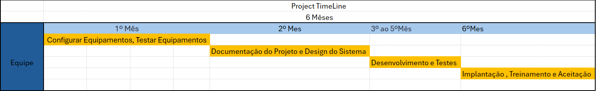

# Especificações do Projeto

Pré-requisitos: <a href="1-Documentação de Contexto.md"> Documentação de Contexto</a>

Definição do problema e ideia de solução a partir da perspectiva do usuário. É composta pela definição do  diagrama de personas, histórias de usuários, requisitos funcionais e não funcionais além das restrições do projeto

Apresente uma visão geral do que será abordado nesta parte do documento, enumerando as técnicas e/ou ferramentas utilizadas para realizar a especificações do projeto

## Personas

Personas 

Ivon: 
62 Anos, Dono de Supermercado Local a +25 anos, não tem um lucro fixo de renda porem tem uma situação financeira relaxada 
Pensa em expandir o negocio abrindo novas franquias de sua loja. Tem dois filhos que ajudam a cuidar do negocio nos dias atuais para aproveitar mais e planejar sua aposentadoria.  
Adora passar seu tempo livre em bares bebendo com amigos e vendo jogos de futebol, aos domingos sempre passa na igreja 

Angelo: 
24 Anos, Trabalha na unimed, faz trabalhos internos e apresenta palestra sobre o sistemas do hospital, tem uma agenda bem apertada no seu dia a dia. Mudou recentemente  para o apartamento da namorada. 
Sempre procurando um emprego melhor e atras de coisas que podem melhorar seu curriculo e seu conhecimento para o mercado de trabalho. 

Brenda: 
26 anos, trabalha numa compania eletrica  e faz faculdade na parte da noite, pretender se formar em TI para poder ter horarios melhores e um salario maior. Procura melhorar de vida pra ter uma mais tranquila e não tanto atarefada. 
Adora ler livros no tempo livre e como não tem muito acaba demorando muito tempo para poder terminar suas leituras 

Willian 
13 anos, estuda numa escola particular e é um aluno exemplar. Tem bastante tempo livre nos seus dias e adora praticar esportes com os amigos. Ama historias antigas. 
Não sabe ainda o que gostaria de ser quando crescer, mas gostaria de alguma forma de ajudar as pessoas, seja como bombeiro, policial, psicologo. 

Enumere e detalhe as personas da sua solução. Para tanto, baseie-se tanto nos documentos disponibilizados na disciplina e/ou nos seguintes links:

> **Links Úteis**:
> - [Rock Content](https://rockcontent.com/blog/personas/)
> - [Hotmart](https://blog.hotmart.com/pt-br/como-criar-persona-negocio/)
> - [O que é persona?](https://resultadosdigitais.com.br/blog/persona-o-que-e/)
> - [Persona x Público-alvo](https://flammo.com.br/blog/persona-e-publico-alvo-qual-a-diferenca/)
> - [Mapa de Empatia](https://resultadosdigitais.com.br/blog/mapa-da-empatia/)
> - [Mapa de Stalkeholders](https://www.racecomunicacao.com.br/blog/como-fazer-o-mapeamento-de-stakeholders/)
>
Lembre-se que você deve ser enumerar e descrever precisamente e personalizada todos os clientes ideais que sua solução almeja.

## Histórias de Usuários

Com base na análise das personas forma identificadas as seguintes histórias de usuários:

|EU COMO... `PERSONA`| QUERO/PRECISO ... `FUNCIONALIDADE` |PARA ... `MOTIVO/VALOR`                 |
|--------------------|------------------------------------|----------------------------------------|
|Ivon                | Lembrete de devolução do livro     | Que eu pare de levar multas da igreja  |
|Ivon                | Vizualizar quais livros estão dispo| Não ir atoa buscar um livro que não tem|
|                    | niveis                             |                                        |
|Angelo              | Reservar o livro antes de ir buscar| Para garantir que ninguem o alugue     |
|Brenda              | Externder o aluguel online         | para não me locomover ate la so para   |
|                    |                                    | externder o aluguel                    |
|Willian             | Avaliar o livro pelo aplicativo    | para os usuarios poderem ver se o livro|
|                    |                                    | vale a pena de ler                     |

Apresente aqui as histórias de usuário que são relevantes para o projeto de sua solução. As Histórias de Usuário consistem em uma ferramenta poderosa para a compreensão e elicitação dos requisitos funcionais e não funcionais da sua aplicação. Se possível, agrupe as histórias de usuário por contexto, para facilitar consultas recorrentes à essa parte do documento.

> **Links Úteis**:
> - [Histórias de usuários com exemplos e template](https://www.atlassian.com/br/agile/project-management/user-stories)
> - [Como escrever boas histórias de usuário (User Stories)](https://medium.com/vertice/como-escrever-boas-users-stories-hist%C3%B3rias-de-usu%C3%A1rios-b29c75043fac)
> - [User Stories: requisitos que humanos entendem](https://www.luiztools.com.br/post/user-stories-descricao-de-requisitos-que-humanos-entendem/)
> - [Histórias de Usuários: mais exemplos](https://www.reqview.com/doc/user-stories-example.html)
> - [9 Common User Story Mistakes](https://airfocus.com/blog/user-story-mistakes/)

## Requisitos

As tabelas que se seguem apresentam os requisitos funcionais e não funcionais que detalham o escopo do projeto. Para determinar a prioridade de requisitos, aplicar uma técnica de priorização de requisitos e detalhar como a técnica foi aplicada.

### Requisitos Funcionais

ID     | Descrição do Requisito                                             | Prioridade
-------|--------------------------------------------------------------------|------------
RF-001 | O sistema deve permitir o cadastro e login de usuários.            | ALTA
RF-002 | O sistema deve fornecer um catálogo de livros físicos com busca e filtros por título, autor, ou categorias. | ALTA
RF-003 | O sistema deve permitir que os usuários façam reservas e empréstimos de livros disponíveis. | ALTA
RF-004 | O sistema deve manter um histórico de empréstimos e devoluções por usuário. | ALTA
RF-005 | O sistema deve enviar notificações para lembrar os usuários sobre prazos de devolução, novos livros adicionados, e atualizações importantes. | ALTA
RF-006 | O sistema deve permitir que os usuários avaliem e comentem os livros que leram. | MÉDIA
RF-007 | O sistema deve fornecer um painel administrativo para que os bibliotecários possam gerenciar o catálogo de livros, reservas, e empréstimos. | ALTA
RF-008 | O sistema deve gerar relatórios sobre o número de empréstimos, livros mais e menos emprestados, histórico de empréstimos, e outros dados relevantes. | MÉDIA
RF-009 | O sistema deve recomendar livros aos usuários com base em seus empréstimos anteriores. | MÉDIA
RF-010 | O sistema deve organizar os livros em diversas categorias, como Religião, Estudos Bíblicos, Ficção Cristã, entre outros. | ALTA
RF-011 | O sistema deve permitir que os usuários adicionem livros à lista de desejos para futura leitura ou reserva. | MÉDIA
RF-012 | O sistema deve mostrar a disponibilidade dos livros em tempo real, indicando se estão emprestados ou disponíveis. | ALTA

### Requisitos não Funcionais

ID      | Descrição do Requisito                                                         | Prioridade
--------|-------------------------------------------------------------------------------|------------
RNF-001 | O sistema deve ser responsivo e otimizado para dispositivos móveis.            | ALTA
RNF-002 | O sistema deve processar requisições dos usuários em no máximo 3 segundos.     | MÉDIA
RNF-003 | O sistema deve suportar dispositivos iOS e Android.                            | ALTA
RNF-004 | O sistema deve ter uma interface amigável e intuitiva.                         | ALTA
RNF-005 | O sistema deve garantir a segurança dos dados dos usuários, com criptografia para senhas e outras informações sensíveis. | ALTA
RNF-006 | O sistema deve ser capaz de operar offline, permitindo que os usuários acessem o catálogo de livros baixados previamente. | MÉDIA

## Restrições

ID   | Descrição da Restrição
-----|------------------------
R-01 | A interface do aplicativo deve ser limpa, moderna e intuitiva, garantindo facilidade de uso tanto em dispositivos móveis quanto em desktops.
R-02 | O cadastro e a atualização de novos conteúdos só podem ser realizados por uma equipe de bibliotecários ou voluntários designados pela igreja.
R-03 | O sistema deve incluir funcionalidades específicas, como reserva de livros, gerenciamento de empréstimos e devoluções, e um sistema de notificações para informar sobre novos livros, prazos de devolução, e atualizações importantes no sistema.

## Diagrama de Casos de Uso

# Gerenciamento de Projeto

Para garantir o sucesso no desenvolvimento do projeto, é necessário gerenciar os seguintes pontos: tempo, equipe, custos e orçamento. A seguir, detalharemos cada um desses aspectos em relação ao nosso projeto.

## Gerenciamento de Tempo

| Etapa                       | Atividade                                                            | Tempo Estimado |
|-----------------------------|----------------------------------------------------------------------|----------------|
| 1. Configurar Equipamentos  | Configurar e instalar os equipamentos necessários em cada máquina envolvida no projeto. | 1 semana       |
| 2. Teste de Equipamentos    | Testar se os equipamentos e ferramentas estão adequados.             | 5 dias         |
| 3. Documentação do Projeto  | Elaborar uma documentação do projeto.                                | 1 mês      |
| 4. Design do Sistema        | Elaborar um design inicial do projeto (Wireframes).                  | 1 semanas      |
| 5. Desenvolvimento          | Codificação.                                                          | 3 meses        |
| 6. Testes                   | Realizar os devidos testes (unitários, integração e aceitação do usuário). | 2 semanas      |
| 7. Implantação              | Configurar o ambiente de implementação.                              | 2 semanas      |
| 8. Treinamento              | Elaborar um treinamento prévio para usuários.                        | 1 semana       |
| 9. Aceitação                | Receber o retorno do Product Owner.                                  | 1 semana       |

## Gerenciamento de Equipe

O gerenciamento adequado de tarefas contribuirá para que o projeto alcance altos níveis de produtividade. Por isso, é fundamental que ocorra a gestão de tarefas e de pessoas, de modo que os times envolvidos no projeto possam ser facilmente gerenciados. 

## Gestão de Orçamento

O processo de determinar o orçamento do projeto é uma tarefa que depende, além dos produtos (saídas) dos processos anteriores do gerenciamento de custos, também de produtos oferecidos por outros processos de gerenciamento, como o escopo e o tempo.

| Fase / Atividade       |     Estimativa de Tempo   | Custo Estimado   
|------------------------|--------------------------- |------------------------------|
| 1.Configuração e teste de equpipamentos  | 2 semanas   | R$1.000
| 2. Documentação do Projeto e Design    | 1 Mês    | R$ 1.000
| 3. Desenvolvimento, teste e implementação  | 3 Meses | R$18.000   
| 4.Ferramentas para o desenvolvimento | Anual |  R$ 3.000
| **TOTAL**                  | |R$23.500                

# Estimativa de Custos

Abaixo está uma estimativa de custos para o projeto de desenvolvimento do aplicativo de gerenciamento de biblioteca para a Igreja Batista Anunciar. A estimativa inclui recursos humanos, hardware, software, redes e serviços.

# Estimativa de Custos

Abaixo está uma estimativa de custos para o desenvolvimento do aplicativo de gerenciamento de biblioteca para a Igreja Batista Anunciar. O projeto será realizado por 6 alunos, utilizando React Native e um banco de dados Firebase, com um prazo de um semestre e supervisão do professor.

## Estimativa de Custos

| Categoria          | Item                                      | Quantidade | Custo Unitário | Custo Total  |
|--------------------|-------------------------------------------|------------|----------------|--------------|
| **Recursos Humanos** | Desenvolvimento, documentação e desing (6 Alunos)     | 6 | R$ 1.000/mês(Desenvolvimento) + R$1.000(Documentação) | R$ 19.000
| **Subtotal Recursos Humanos**                                |            |          |      | **R$18.000** |
| **Hardware**        | Preparação de Maquinas (já existentes)     | 1          | R$ 1.000         | R$ 1.000       |
|                    | Equipamentos de Desenvolvimento (se necessário) | 0          | R$ 0           | R$ 0         |
| **Subtotal Hardware**                                      |            |          |      | **R$ 1.000**   |
| **Software**        | Banco de Dados Mongo Atlas Free         | 1          | R$ 0       | R$ 0     |
| **Subtotal Software**                                      |            |           |     | **R$ 0** |
| **Redes**           | Hospedagem em Nuvem (Se necessário)  | 1          | $ 0.8/Hora         | $ 3.494,40       
| **Subtotal Redes**                                         |            |        |        | **$ 3.494,40** |
| **Serviços**        | Supervisão do Professor (6 meses)          | 1          | R$ 2.000/mês   | R$ 12.000    |
| **Subtotal Serviços**                                       |            |        |        | **R$ 12.000** |
| **Total Geral**                                           |            |        |        | **R$ 32.000** |

